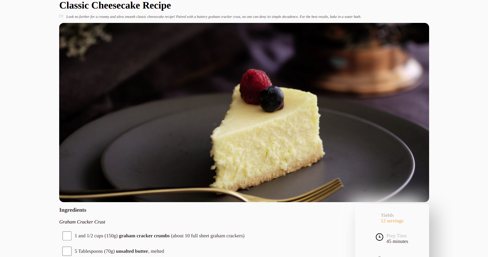

<!-- Please update value in the {}  -->

<h1 align="center">Receipe Page</h1>

   Solution for a challenge from  <a href="http://devchallenges.io" target="_blank">Devchallenges.io</a>.

  <h3>
    <a href="https://mubashirwaheed.github.io/Recipe-page/">
      Demo
    </a>
     | 
    <a href="https://devchallenges.io/challenges/OEKdUZ6xs0h99C38XVht">
      Challenge
    </a>
  </h3>

## Overvirew 
Created this project using only HTML and CSS. 
Purpose of this project is to learn responsive web design and to acheive this I used flexbox. 
I also used mobile first approach. 

## Acknowledgements
- [Steps to replicate a design with only HTML and CSS](https://devchallenges-blogs.web.app/how-to-replicate-design/)

## Contact

- Linkedin [Mubashir Waheed](https://www.linkedin.com/in/mubashirwaheed/)
